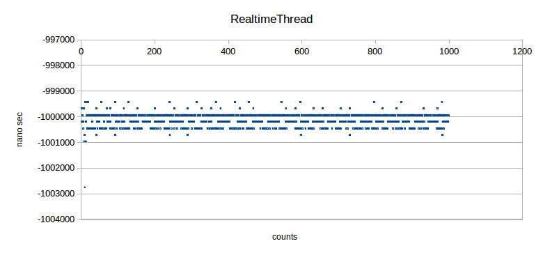
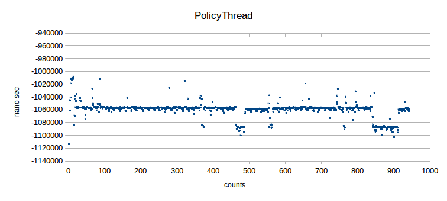

librealtime
==============
## A modern and extremely easy header only C++11 library for real time processing in Linux.

## 1.Introduction

This library's target is support to use real-time processing which is needed robotics and system control field.

This library allows you to make strict periodic tasks
and the tasks with priority without difficult Linux kernel and POSIX API knowledge

You can use librealtime library like std::thread library.
So, you can start to use librealtime quickly.

librealtime library works only on **Linux**. Windows does **NOT** supported.

Web API documentation is [HERE](https://harumo11.github.io/librealtime/)


## 2.Contents

### 2.1 Library
|Name|Discription|Scheduling|
|----|-----------|----------|
|RealtimeThread|A real-time periodic thread|SCHED_DEADLINE|
|PolicyThread|A std::thread added priority|SCHED_FIFO|

### 2.2 The API documentation(Doxygen)

- [web api documentation](https://harumo11.github.io/librealtime/)
- local api documentation(librealtime/docs/index.html)

Please open with web browser(firefox, chrome and so on).

If you want to build the API documentation, type following commands.
```
cd librealtime
doxygen Doxyfile
cd html
firefox index.html
```

## 3. How to use

### 3.1 Realtime Thread

```cpp
#include <iostream>
#include <unistd.h>
#include <librealtime/RealtimeThread.hpp>

void func_real(int num){
	std::cout << "This is Real-Time periodic thread " << num << std::endl;
}

int main(void){
    //(Freequency[Hz], function, arguments)
	RealtimeThread rth(10, func, 1234);
	
	//Run in 3 sec. If set true, get RealTime thread, otherwise, nomal priodic thread.
	rth.start(true);
	sleep(3);
	rth.join();
}
```

When this program is run, "1234" x 30 should be output.
```
1234
1234
1234
.
.
.
1234
```


### 3.2 Policy Thread

```cpp
#include <iostream>
#include <librealtime/PolicyThread.hpp>

void func_policy(int num){
	std::cout << "This is Policy-Thread " << num << std::endl;
}

int main(void){

	//set function and arguments
	PolicyThread pth(func_policy, num);
	//(Priority. from 0 to 99)
	pth.start(30);
	pth.join();
}
```
More samples can be found in example directory.
In order build, type following commands.

```
cd librealtime/example
mkdir build
cd build
cmake ..
make
```

## 3.3 Installation

You can start to try librealtime in 30 seconds!

```
git clone https://github.com/harumo11/librealtime.git
cd librealtime
sudo cp -r librealtime /usr/local/include
```
Because librealtime is a header only library, you **Do NOT** need to build.

## 4.Dependency

- librealtime can use **ONLY** linux.
	This library was tested on **Ubuntu**, **Linux Mint**, **Debian**.
- librealtime require C++11 or more greater.


## 5.Accuracy (Realtime thread **vs.** Policy thread + max priority + timer)

What's happen if realtime thread is made with PolicyThread?
In other words, What's difference between RealtimeThread and PolicyThread?

Ok, Let's conduct a experiment!

Two program are made for experiment. you can find those programs in
**librealtime/example/testRealtimeThread.cpp, PolicyThread_e.cpp**
Those program tries to call a function 1000 times in 1 second. One program has a thread which is made by RealtimeThread, 
Another program has a thread which is made by PolicyThread and timer which wakes up every 1/1000 sec.

In short, environment of experiment is as below.
- 1000[Hz]
- One thread is RealtimeThread(librealtime/example/testRealtime.cpp)
- Onother thread is PolicyThread(librealtime/example/testPolicyThread_e.cpp)

The results are as below.



|Thread|Average|Standerd deviation|Counts|
|------|--------|------------------|------|
|RealtimeThread|1000129.986[nano sec]|1452.211[nano sec]|1000/1000 times|
|PolicyThread|1060530.358[nano sec]|12778.745[nano sec]|944/1000 times|

**NOTE** RealtimeThread occupy a core. If you use three RealtimeThread, three cores can not
be used with other task. PolicyThread does not occupy a core.
